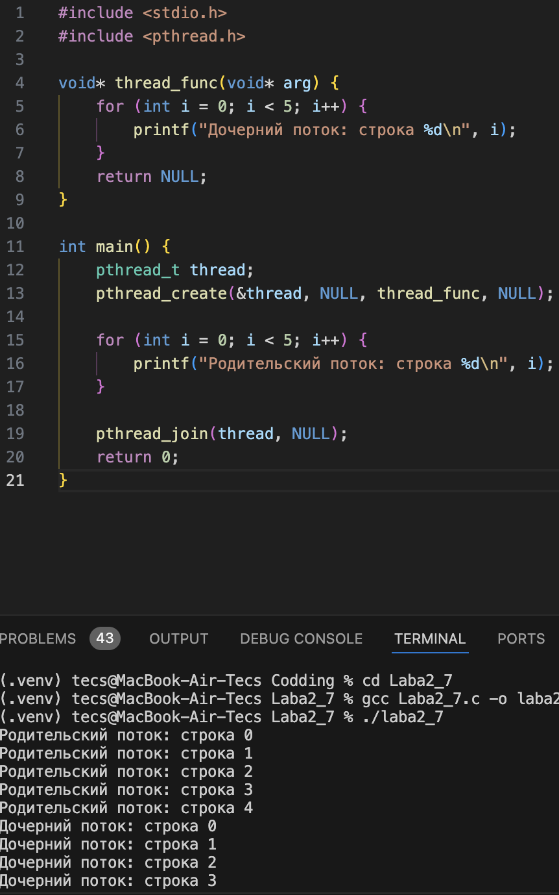
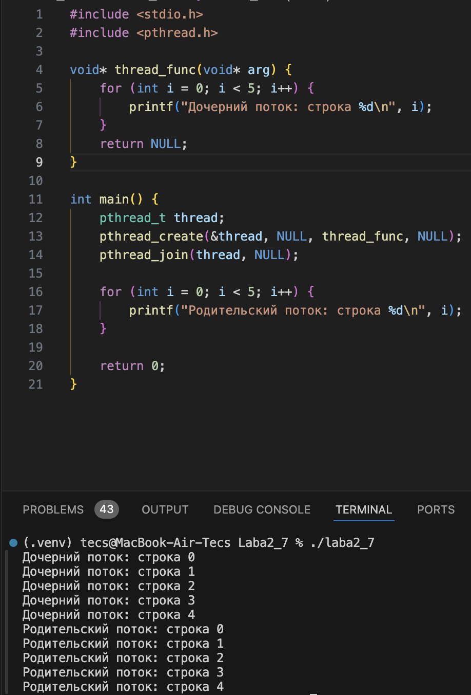
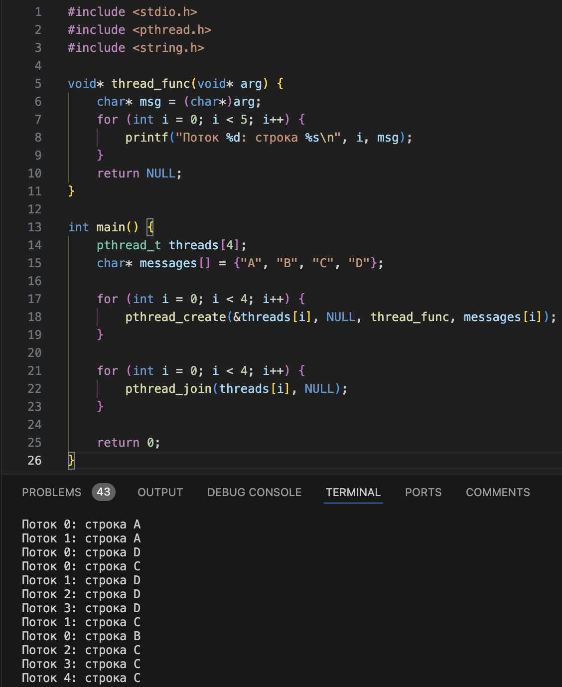
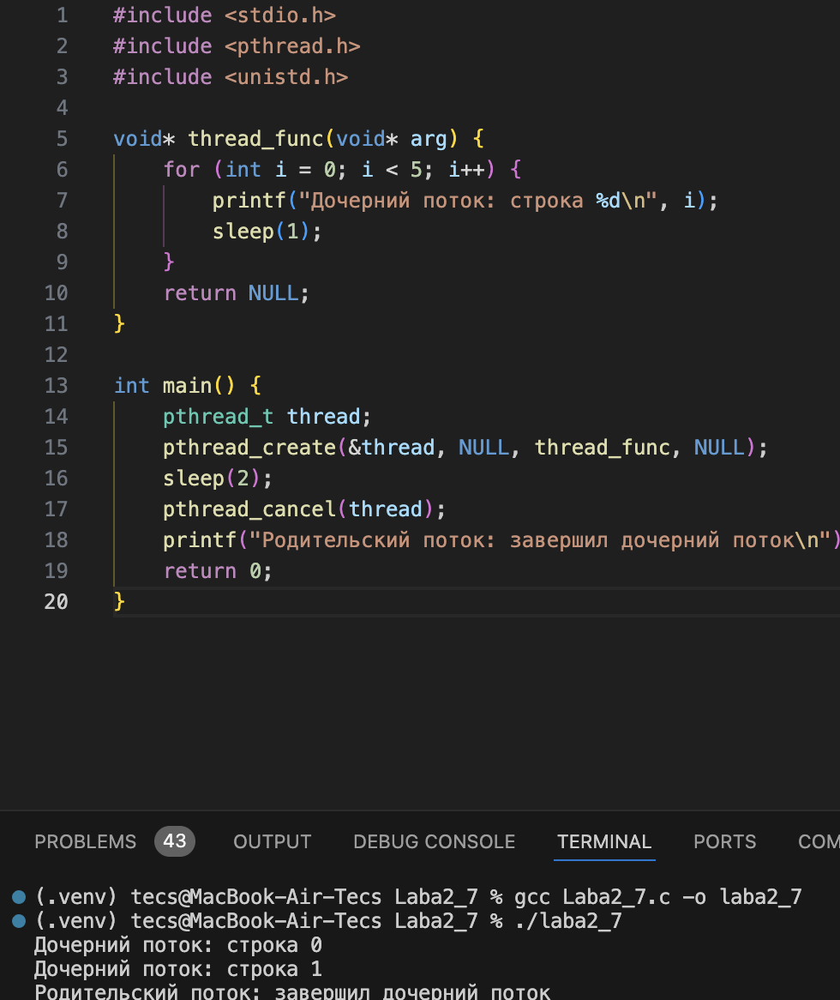
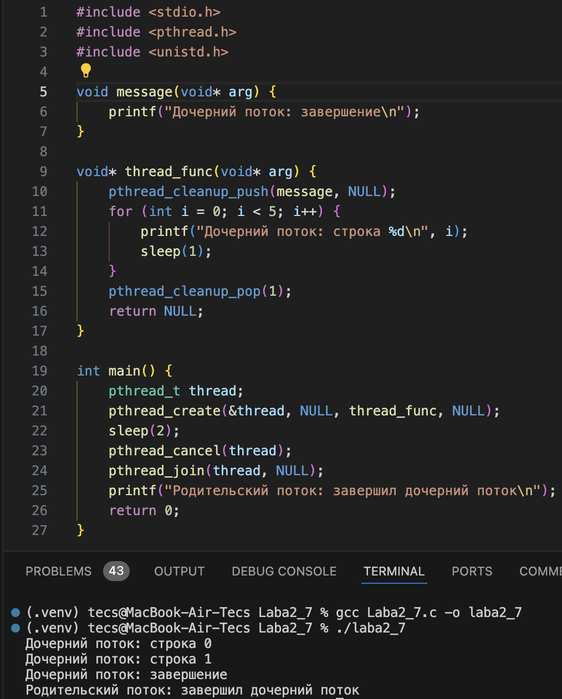
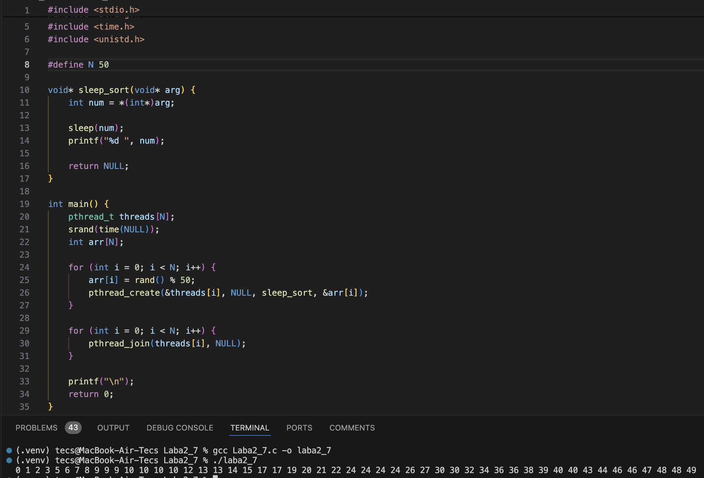
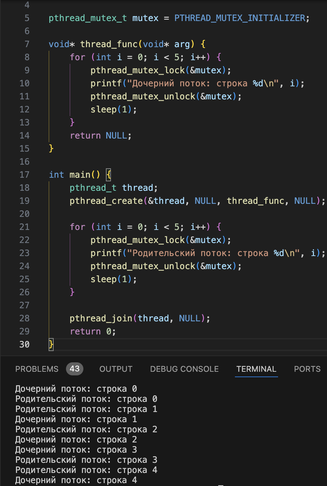
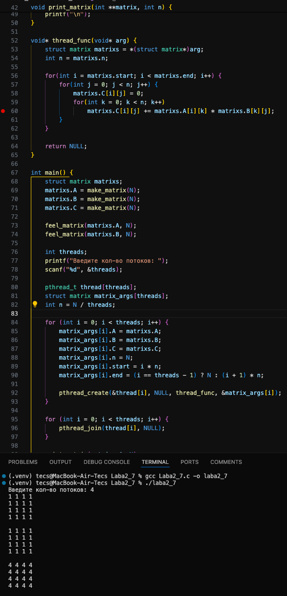
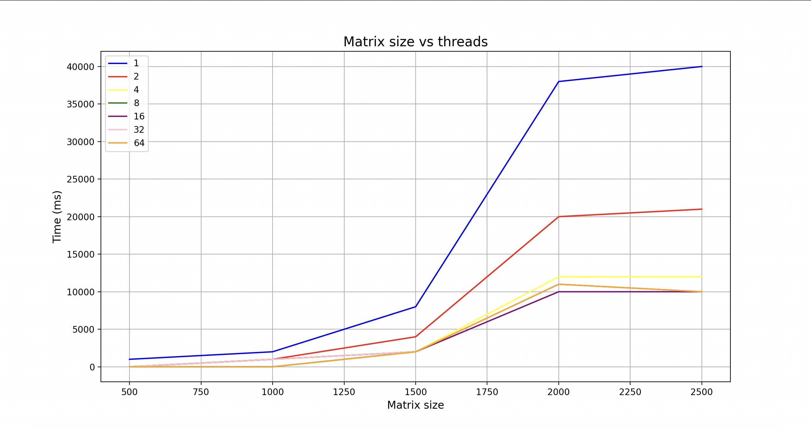
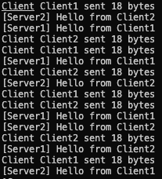

# Ход работы  

## Оценка 3

### Задание 1  

Создал поток с помощью `pthread_create()`.  

  

### Задание 2  

Модифицировал задание 1 так, что родительский поток выводит текст после завершения дочернего потока.



### Задание 3  

Модифицировал задание 2 так, что основной поток создает 4 потока, исполняющих одну и ту же функцию.



### Задание 4  

Добавить сон с помощью sleep() в функцию потоков между выводами строк. 



### Задание 5  

Модифицировал задание 4 так, чтобы дочерний поток перед завершение распечатывал сообщение об этом. Использовать `pthread_cleanup_push()`.



### Задание 6  

Реализовать алгоритм сортировки Sleepsort.



## Оценка 4

### Задание 7  

Модифицировал программу из задания 5 так, чтобы вывод родительского и дочернего потока был синхронизован.



### Задание 8  

Написал функцию произведения двух квадратных матриц A и B размером NxN. Реализовал возможность с командной строки считать размер матрицы и количество потоков. Распараллелил перемножение матриц разбив матрицу на равные части между потоками в главной функции.



### Задание 9  

Замерил время выполнения с момента создания потоков (до цикла с pthread_create) и до завершения работы потоков (после цикла pthread_join). Построил график. Можем заметить одинаковое примерное одинаковое время выполнения программы на 8, 16, 32 и 64 потоках, это связано с тем, что мой процессор может работать только на 8 потоках одновременно.



## Оценка 5

### Задание 10  

Реализовать очередь сообщений (FIFO), которая будет использоваться для обмена сообщениями между потоками «сервера» (потребитель) и «клиента» (производитель).



**Код для задания 8**

```
#include <stdio.h>
#include <stdlib.h>
#include <pthread.h>
#include <unistd.h>
#include <time.h>

#define N 2500

pthread_mutex_t mutex = PTHREAD_MUTEX_INITIALIZER;

struct matrix {
    int **A;
    int **B;
    int **C;
    int n;
    int start;
    int end;
};

int **make_matrix(int n) {
    int **matrix = (int**)malloc(n * sizeof(int*));
    for (int i = 0; i < n; i++) {
        matrix[i] = (int*)malloc(n * sizeof(int));
    }
    return matrix;
}

void free_matrix(int **matrix, int n) {
    for (int i = 0; i < n; i++) {
        free(matrix[i]);
    }
    free(matrix);
}

void feel_matrix(int **matrix, int n) {
    for (int i = 0; i < n; i++) {
        for (int j = 0; j < n; j++) {
            matrix[i][j] = 1;
        }
    }
}

void print_matrix(int **matrix, int n) {
    for (int i = 0; i < n; i++) {
        for (int j = 0; j < n; j++) {
            printf("%d ", matrix[i][j]);
        }
        printf("\n");
    }
    printf("\n");
}

void* thread_func(void* arg) {
    struct matrix matrixs = *(struct matrix*)arg;
    int n = matrixs.n;

    for(int i = matrixs.start; i < matrixs.end; i++) {
        for(int j = 0; j < n; j++) {
            matrixs.C[i][j] = 0;
            for(int k = 0; k < n; k++)
                matrixs.C[i][j] += matrixs.A[i][k] * matrixs.B[k][j];
        }
    }

    return NULL;
}

int main() {
    struct matrix matrixs;
    matrixs.A = make_matrix(N);
    matrixs.B = make_matrix(N);
    matrixs.C = make_matrix(N);

    feel_matrix(matrixs.A, N);
    feel_matrix(matrixs.B, N);

    int threads;
    printf("Введите кол-во потоков: ");
    scanf("%d", &threads);

    pthread_t thread[threads];
    struct matrix matrix_args[threads];
    int n = N / threads;

    time_t t0 = time(0);
    for (int i = 0; i < threads; i++) {
        matrix_args[i].A = matrixs.A;
        matrix_args[i].B = matrixs.B;
        matrix_args[i].C = matrixs.C;
        matrix_args[i].n = N;
        matrix_args[i].start = i * n;
        matrix_args[i].end = (i == threads - 1) ? N : (i + 1) * n;

        pthread_create(&thread[i], NULL, thread_func, &matrix_args[i]);
    }

    for (int i = 0; i < threads; i++) {
        pthread_join(thread[i], NULL);
    }
    time_t t1 = time(0);

    if (N < 5) {
        print_matrix(matrixs.A, N);
        print_matrix(matrixs.B, N);
        print_matrix(matrixs.C, N);
    }
    double time_in_seconds = difftime(t1, t0);
    printf("%lf", time_in_seconds * 1000);

    free_matrix(matrixs.A, N);
    free_matrix(matrixs.B, N);
    free_matrix(matrixs.C, N);

    return 0;
}
```

**Код для задания 10**

```
#include <stdio.h>
#include <stdlib.h>
#include <string.h>
#include <pthread.h>
#include <unistd.h>
#include <time.h>

#define MAX_MSG_LEN 128
#define MAX_QUEUE_SIZE 10

typedef struct {
    char messages[MAX_QUEUE_SIZE][MAX_MSG_LEN + 1];
    int front, rear;
    int count;
    pthread_mutex_t mutex;
    pthread_cond_t not_full;
    pthread_cond_t not_empty;
} MessageQueue;

typedef struct {
    char name[32];
    MessageQueue *queue;
} ThreadData;

void queueInit(MessageQueue *q) {
    q->front = 0;
    q->rear = 0;
    q->count = 0;
    pthread_mutex_init(&q->mutex, NULL);
    pthread_cond_init(&q->not_full, NULL);
    pthread_cond_init(&q->not_empty, NULL);
}

void queueDestroy(MessageQueue *q) {
    pthread_mutex_destroy(&q->mutex);
    pthread_cond_destroy(&q->not_full);
    pthread_cond_destroy(&q->not_empty);
}

int msgSend(MessageQueue *q, const char *msg) {
    pthread_mutex_lock(&q->mutex);
    
    while (q->count >= MAX_QUEUE_SIZE) {
        pthread_cond_wait(&q->not_full, &q->mutex);
    }
    
    int len = strlen(msg);
    if (len > MAX_MSG_LEN) {
        len = MAX_MSG_LEN;
    }
    
    strncpy(q->messages[q->rear], msg, len);
    q->messages[q->rear][len] = '\0';
    q->rear = (q->rear + 1) % MAX_QUEUE_SIZE;
    q->count++;
    
    pthread_cond_signal(&q->not_empty);
    pthread_mutex_unlock(&q->mutex);
    
    return len;
}

int msgRecv(MessageQueue *q, char *buf, size_t bufsize) {
    pthread_mutex_lock(&q->mutex);
    
    while (q->count <= 0) {
        pthread_cond_wait(&q->not_empty, &q->mutex);
    }
    
    int len = strlen(q->messages[q->front]);
    if (len > bufsize - 1) {
        len = bufsize - 1;
    }
    
    strncpy(buf, q->messages[q->front], len);
    buf[len] = '\0';
    q->front = (q->front + 1) % MAX_QUEUE_SIZE;
    q->count--;
    
    pthread_cond_signal(&q->not_full);
    pthread_mutex_unlock(&q->mutex);
    
    return len;
}

void *clientThread(void *arg) {
    ThreadData *data = (ThreadData *)arg;
    MessageQueue *queue = data->queue;
    const char *name = data->name;
    
    srand(time(NULL) + (unsigned long)pthread_self());
    
    while (1) {
        char msg[MAX_MSG_LEN + 1];
        int msg_len = snprintf(msg, sizeof(msg), "Hello from %s", name);
        
        int sent = msgSend(queue, msg);
        printf("Client %s sent %d bytes\n", name, sent);
        
        usleep(rand() % 1000000 + 1000000); 
    }
    
    return NULL;
}

void *serverThread(void *arg) {
    ThreadData *data = (ThreadData *)arg;
    MessageQueue *queue = data->queue;
    const char *name = data->name;
    
    srand(time(NULL) + (unsigned long)pthread_self());
    
    while (1) {
        char buf[MAX_MSG_LEN + 1];
        int received = msgRecv(queue, buf, sizeof(buf));
        
        printf("[%s] %s\n", name, buf);
        
        usleep(rand() % 1000000 + 1000000); 
    }
    
    return NULL;
}

int main() {
    MessageQueue queue;
    queueInit(&queue);
    
    const int num_clients = 2;
    const int num_servers = 2;
    
    pthread_t clients[num_clients];
    pthread_t servers[num_servers];
    
    ThreadData client_data[num_clients];
    ThreadData server_data[num_servers];
    
    for (int i = 0; i < num_clients; i++) {
        snprintf(client_data[i].name, sizeof(client_data[i].name), "Client%d", i+1);
        client_data[i].queue = &queue;
        pthread_create(&clients[i], NULL, clientThread, &client_data[i]);
    }
    
    for (int i = 0; i < num_servers; i++) {
        snprintf(server_data[i].name, sizeof(server_data[i].name), "Server%d", i+1);
        server_data[i].queue = &queue;
        pthread_create(&servers[i], NULL, serverThread, &server_data[i]);
    }
    
    for (int i = 0; i < num_clients; i++) {
        pthread_join(clients[i], NULL);
    }
    
    for (int i = 0; i < num_servers; i++) {
        pthread_join(servers[i], NULL);
    }
    
    queueDestroy(&queue);
    
    return 0;
}
```
