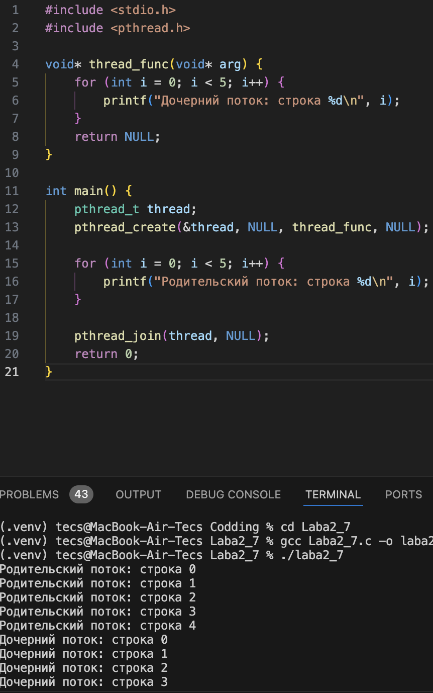
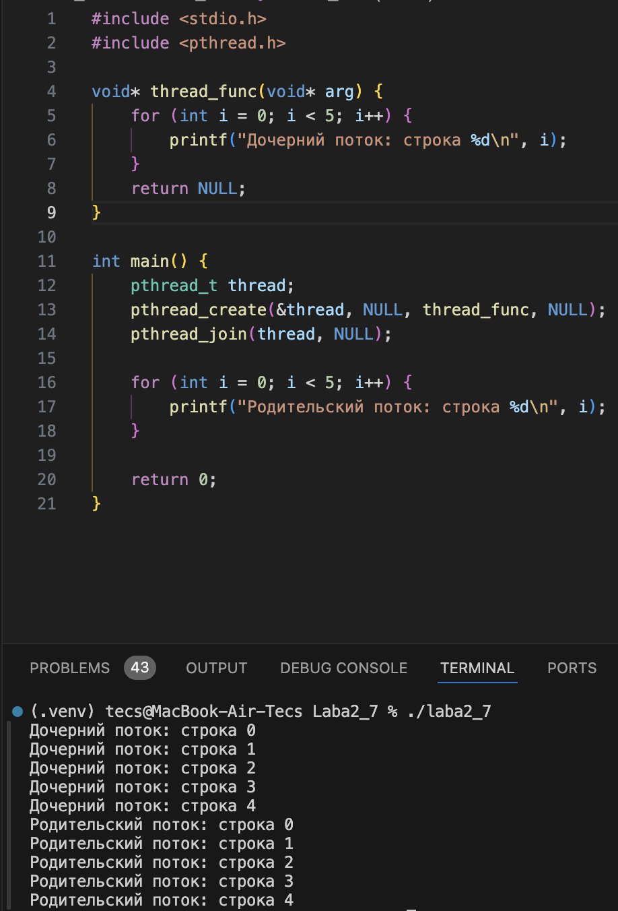
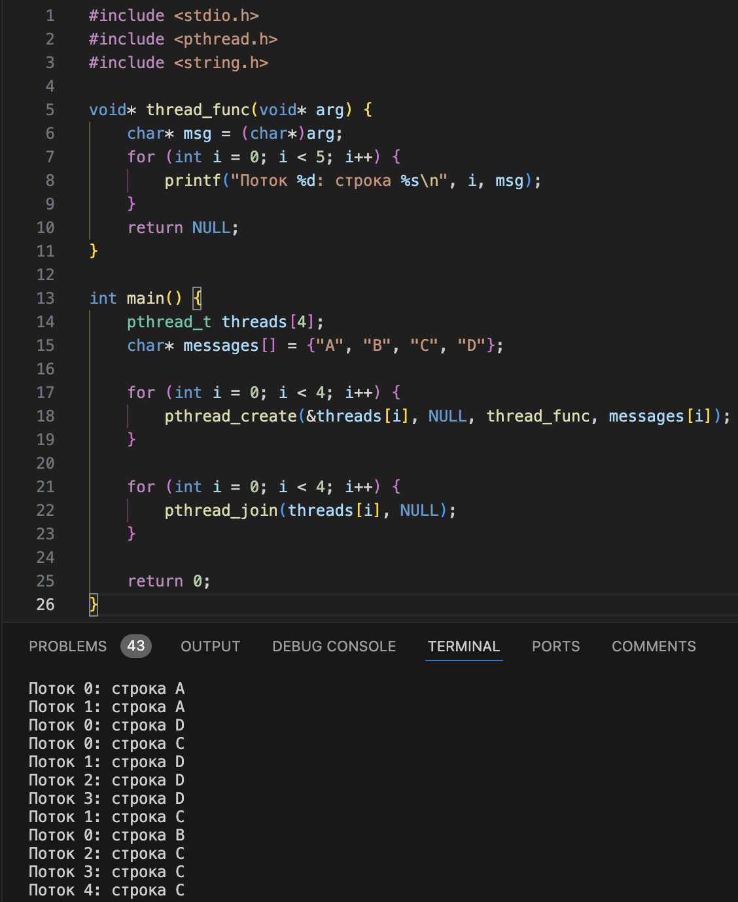
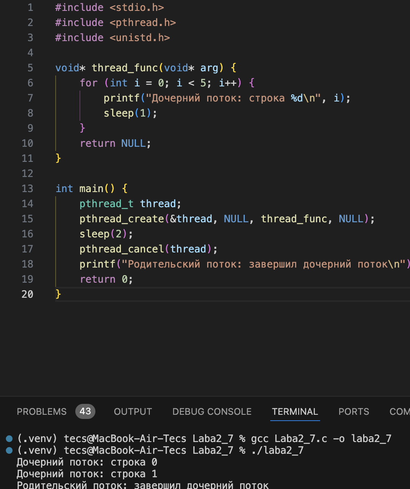
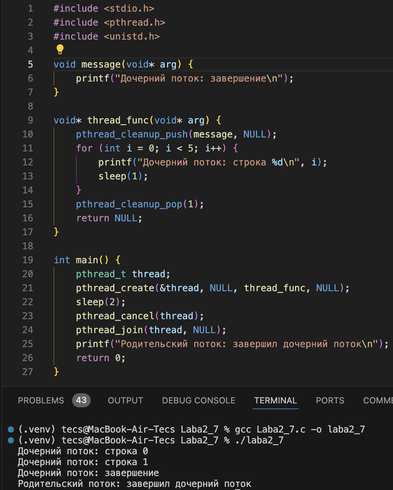
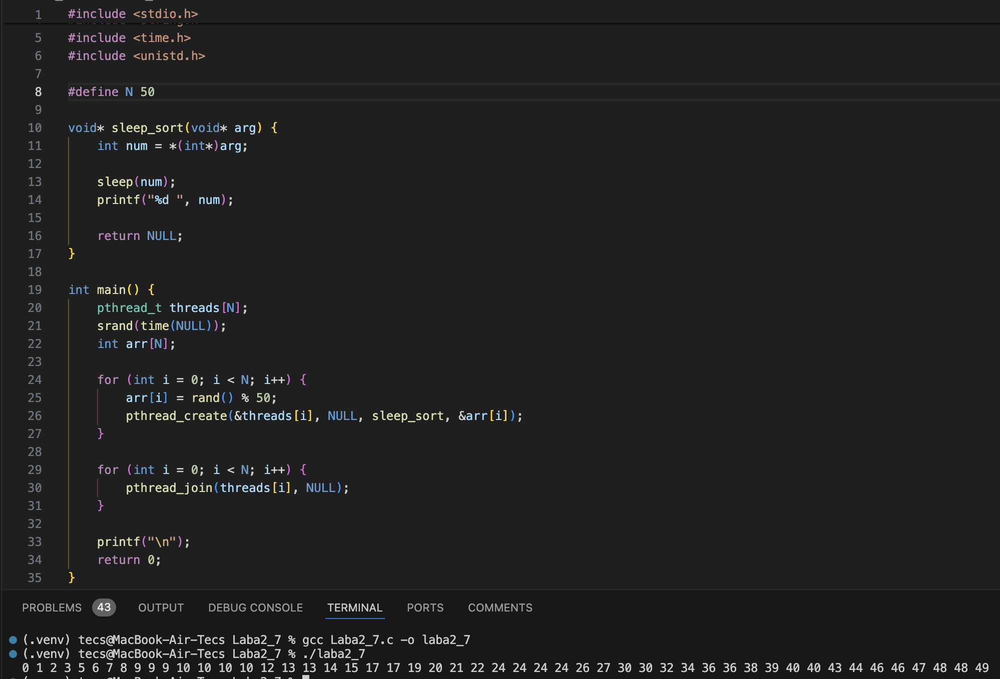
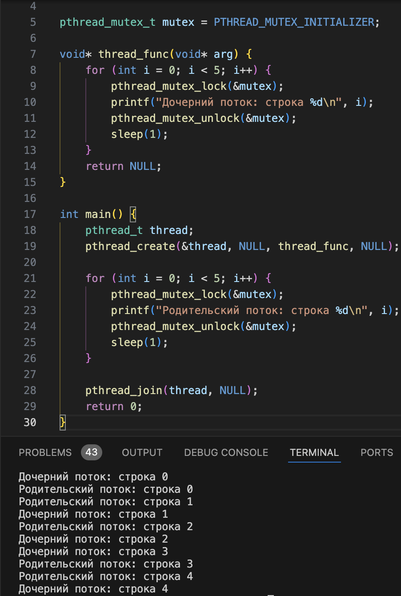
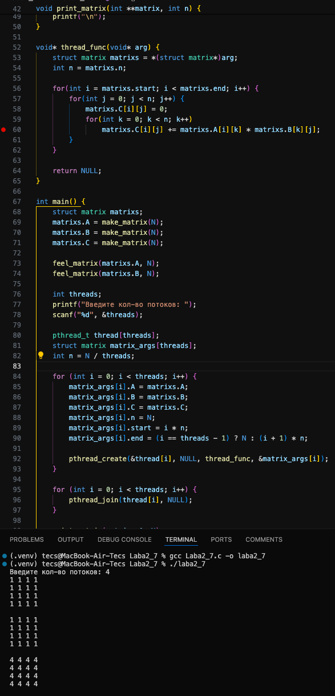
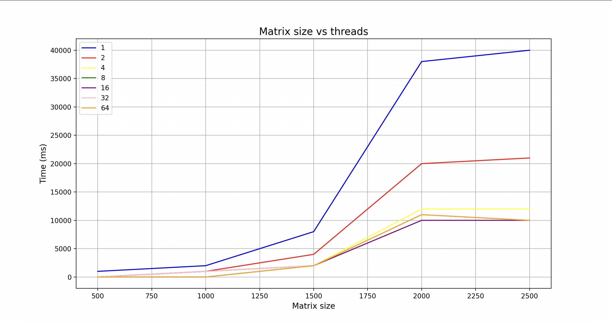
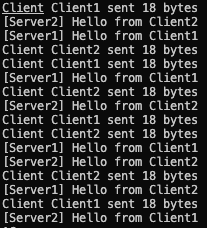

# Ход работы  

## Оценка 3

### Задание 1  

Создал поток с помощью `pthread_create()`.  

  

### Задание 2  

Модифицировал задание 1 так, что родительский поток выводит текст после завершения дочернего потока.

### Задание 3  

Модифицировал задание 2 так, что основной поток создает 4 потока, исполняющих одну и ту же функцию.

### Задание 4  

Добавить сон с помощью sleep() в функцию потоков между выводами строк. 

### Задание 5  

Модифицировал задание 4 так, чтобы дочерний поток перед завершение распечатывал сообщение об этом. Использовать `pthread_cleanup_push()`.

### Задание 6  

Реализовать алгоритм сортировки Sleepsort.

## Оценка 4

### Задание 7  

Модифицировал программу из задания 5 так, чтобы вывод родительского и дочернего потока был синхронизован.

### Задание 8  

Написал функцию произведения двух квадратных матриц A и B размером NxN. Реализовал возможность с командной строки считать размер матрицы и количество потоков. Распараллелил перемножение матриц разбив матрицу на равные части между потоками в главной функции.

### Задание 9  

Замерил время выполнения с момента создания потоков (до цикла с pthread_create) и до завершения работы потоков (после цикла pthread_join). Построил график. Можем заметить одинаковое примерное одинаковое время выполнения программы на 8, 16, 32 и 64 потоках, это связано с тем, что мой процессор может работать только на 8 потоках одновременно.

## Оценка 5

### Задание 10  

Реализовать очередь сообщений (FIFO), которая будет использоваться для обмена сообщениями между потоками «сервера» (потребитель) и «клиента» (производитель).

